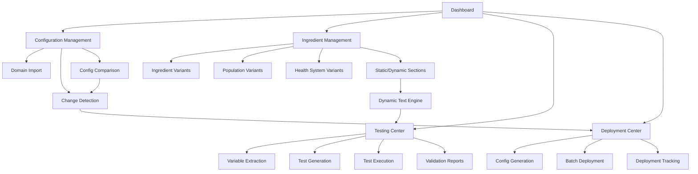

# User Journeys - Dynamic Text Application

## Overview
This document captures the core user journeys for the Dynamic Text application, mapping how users interact with the system to accomplish their primary goals. These journeys integrate functionality from the original Svelte implementation with the new Next.js architecture.

## Primary User Personas

### 1. Pharmacy Informaticist
- **Goal**: Organize and manage TPN configurations across multiple domains and health systems
- **Needs**: Configuration management, change detection, testing framework, deployment tools
- **Technical Level**: Advanced
- **Key Responsibilities**:
  - Maintain reference text (static and dynamic) for TPN advisor
  - Manage ingredient configurations across different domains
  - Deploy updates to multiple health systems
  - Test dynamic text sections with extracted variables
  - Compare configurations between health systems

## Core User Journeys

### Journey 1: Ingredient Selection and Configuration
**User**: Pharmacy Informaticist  
**Goal**: Select and configure ingredients for TPN formulation based on patient population and health system

#### Steps:
1. **Start Point**: Main application dashboard
2. **View Ingredient Panel**: 
   - Left side panel displays all ingredients
   - Ingredients grouped by type (e.g., Amino Acids, Lipids, Electrolytes, Vitamins, Trace Elements)
   - Each ingredient type shows as collapsible category
3. **Select Ingredient**:
   - Click on specific ingredient to view available variants
   - System presents different options based on:
     - **Population**: Neonatal (neo), Child, Adolescent, Adult
     - **Health System**: Different hospital systems or protocols
4. **Choose Ingredient Variant**:
   - Select appropriate population-specific version
   - Choose health system configuration if multiple exist
   - Each variant represents: one ingredient per population per health system
5. **View Ingredient Sections**:
   - System displays sections for selected ingredient variant:
     - **Static Sections**: Fixed content, protocols, guidelines
     - **Dynamic Sections**: Calculated values, patient-specific data
   - Sections may include: dosing guidelines, contraindications, monitoring parameters
6. **Configure Ingredient Parameters**:
   - Adjust concentrations, volumes, or other parameters
   - Real-time validation of selected values
   - Preview impact on overall TPN formulation
7. **Add to Formulation**:
   - Confirm ingredient selection
   - Ingredient added to current TPN formulation
   - System updates total calculations and validation

#### Key Components Connected:
- `IngredientPanel` (Left side ingredient browser)
- `IngredientTypeGroup` (Collapsible ingredient categories)
- `IngredientVariantSelector` (Population/health system selection)
- `IngredientSectionDisplay` (Static and dynamic sections)
- `IngredientParameterEditor` (Concentration/volume adjustments)
- `TPNFormulationManager` (Overall formulation state)
- `ValidationEngine` (Real-time validation)

### Journey 2: Dynamic Text Testing and Validation
**User**: Pharmacy Informaticist  
**Goal**: Test dynamic text sections with extracted variables to ensure robust, tested, and stable reference text

#### Steps:
1. **Start Point**: Navigate to Testing section (`/testing`)
2. **Select Ingredient**: Choose ingredient with dynamic text sections
3. **Extract Variables**: 
   - System automatically extracts variables from dynamic text
   - Display variable list with types and constraints
4. **Generate Test Cases**:
   - Use `VariableTestGenerator` to create test scenarios
   - Include edge cases, boundary values, and typical ranges
5. **Run Test Suite**:
   - Execute tests with `DynamicTextTestRunner`
   - Validate all dynamic text sections render correctly
6. **Review Test Results**:
   - View test coverage and pass/fail status
   - Identify problematic variable combinations
7. **Fix Issues**:
   - Update dynamic text based on test failures
   - Re-run tests to ensure stability
8. **Document Test Results**:
   - Save test suite for future regression testing
   - Export test reports for validation

#### Key Components Connected:
- `VariableExtractor` (Extract variables from dynamic text)
- `TestCaseGenerator` (Generate comprehensive test scenarios)
- `DynamicTextTestRunner` (Execute test suites)
- `TestResultViewer` (Display test outcomes)
- `RegressionTestManager` (Manage test suites over time)

### Journey 3: Configuration Management Across Domains
**User**: Pharmacy Informaticist  
**Goal**: Manage all different configurations across different domains and health systems

#### Steps:
1. **Start Point**: Navigate to Configuration Management (`/configs/manage`)
2. **View Domain Overview**:
   - `DomainDashboard` shows all managed domains/health systems
   - Each domain displays ingredient count, last update, status
3. **Import Configuration**:
   - Click "Import Config" for specific domain
   - Use `ConfigImportWizard` to upload domain configuration
   - System parses and validates configuration format
4. **Map Domain Ingredients**:
   - `IngredientMapper` matches domain ingredients to master database
   - Handle naming variations and missing ingredients
5. **Validate Configuration**:
   - Run validation checks against current ingredient sections
   - Identify missing or outdated ingredient data
6. **Store Domain Config**:
   - Save configuration with domain metadata
   - Link to specific health system and population variants
7. **Monitor Changes**:
   - Set up alerts for configuration updates
   - Track version history per domain


#### Key Components Connected:
- `DomainDashboard` (Overview of all managed domains)
- `ConfigImportWizard` (Import and parse domain configurations)
- `IngredientMapper` (Match domain ingredients to master database)
- `ConfigValidator` (Validate configurations against current data)
- `DomainVersionTracker` (Track changes and versions per domain)

### Journey 4: Change Detection Between Domains
**User**: Pharmacy Informaticist  
**Goal**: Import config from domain and easily spot changes from other domains and ingredients

#### Steps:
1. **Start Point**: Navigate to Change Detection (`/changes/detect`)
2. **Import Domain Configuration**:
   - Upload or paste configuration from specific domain
   - System parses and normalizes configuration data
3. **Compare Against Master**:
   - `ChangeDetector` compares imported config with master database
   - Identifies new, modified, and removed ingredients
4. **Highlight Differences**:
   - `DiffVisualizer` shows color-coded changes
   - Group changes by ingredient type and severity
5. **Review Ingredient Changes**:
   - Click on specific ingredients to see detailed differences
   - View before/after values for each ingredient
6. **Validate Against Current Sections**:
   - Check if changed ingredients have current section data
   - Get green check for ingredients matching current sections
7. **Generate Change Report**:
   - Export detailed change summary
   - Include recommendations for updates

#### Key Components Connected:
- `ChangeDetector` (Compare configurations and identify differences)
- `DiffVisualizer` (Color-coded change display)
- `IngredientChangeViewer` (Detailed ingredient change analysis)
- `SectionValidator` (Validate ingredients against current sections)
- `ChangeReportGenerator` (Export change summaries)

### Journey 5: Ingredient Deployment to All Domains
**User**: Pharmacy Informaticist  
**Goal**: Deploy changes for an ingredient to all domains by importing config and selecting specific ingredients to update

#### Steps:
1. **Start Point**: Navigate to Deployment Center (`/deploy`)
2. **Import Domain Configuration**:
   - Import config from target domain
   - System displays current ingredient state
3. **Select Ingredient for Update**:
   - Choose specific ingredient to update
   - View current vs. new ingredient data
4. **Preview Changes**:
   - `DeploymentPreview` shows what will change
   - Validate ingredient sections are current
5. **Generate Updated Configuration**:
   - System creates new config with updated ingredient
   - Maintain all other ingredients unchanged
6. **Copy Configuration**:
   - One-click copy of updated configuration
   - Ready to paste into domain system
7. **Deploy to Multiple Domains**:
   - Select multiple domains for deployment
   - Batch update configurations across systems
8. **Track Deployment Status**:
   - Monitor deployment success across domains
   - Generate deployment reports

#### Key Components Connected:
- `DeploymentCenter` (Main deployment interface)
- `ConfigImporter` (Import domain configurations)
- `IngredientSelector` (Choose ingredients to update)
- `DeploymentPreview` (Preview changes before deployment)
- `ConfigGenerator` (Generate updated configurations)
- `BatchDeployer` (Deploy to multiple domains)
- `DeploymentTracker` (Monitor deployment status)

### Journey 6: Dynamic Text Exploration Between Health Systems
**User**: Pharmacy Informaticist  
**Goal**: Explore and compare dynamic text for ingredients between different health systems

#### Steps:
1. **Start Point**: Navigate to Exploration Center (`/explore`)
2. **Select Ingredient**:
   - Choose ingredient to explore
   - View all available health system variants
3. **Compare Dynamic Text**:
   - `DynamicTextComparator` displays side-by-side comparison
   - Highlight differences in static and dynamic sections
4. **Analyze Variations**:
   - View how different health systems handle same ingredient
   - Compare population-specific variations (neo, child, adolescent, adult)
5. **Test Dynamic Logic**:
   - Run test scenarios across different health systems
   - Validate dynamic text with various input parameters
6. **Export Comparison**:
   - Generate detailed comparison reports
   - Document differences and similarities
7. **Identify Best Practices**:
   - Highlight effective dynamic text patterns
   - Note areas for standardization

#### Key Components Connected:
- `ExplorationCenter` (Main exploration interface)
- `DynamicTextComparator` (Side-by-side text comparison)
- `HealthSystemSelector` (Choose health systems to compare)
- `PopulationVariantViewer` (View population-specific variations)
- `DynamicLogicTester` (Test dynamic text across systems)
- `ComparisonReportGenerator` (Export comparison analysis)

## Data Flow Architecture

### State Management Flow
```
User Action → Redux Action → Store Update → Component Re-render
                    ↓
            Domain Config Sync
                    ↓
            Firebase Sync (if enabled)
                    ↓
            Local Storage Backup
```

### Key State Slices:
1. **`ingredientSlice`**: Ingredient management and variants
2. **`configurationSlice`**: Domain configurations and mappings
3. **`tpnSlice`**: TPN calculation state
4. **`validationSlice`**: Test results and validation status
5. **`deploymentSlice`**: Deployment tracking and status
6. **`comparisonSlice`**: Configuration comparison state
7. **`editorSlice`**: Dynamic text editing state
8. **`navigationSlice`**: UI navigation state
9. **`settingsSlice`**: User preferences
10. **`dashboardSlice`**: Dashboard metrics

### Data Persistence Strategy:
- **Redux Persist**: Critical application state
- **Domain Configs**: JSON configuration files per health system
- **Firebase Realtime DB**: Shared ingredient sections and collaboration
- **Local Storage**: User preferences and recent configs
- **IndexedDB**: Large datasets, test results, and offline cache

## Integration Points

### Component Communication Patterns:

1. **Direct Props**: Parent-child communication
2. **Redux Store**: Cross-component state sharing
3. **Context Providers**: Theme, auth, loading states
4. **Event Bus**: Real-time updates and notifications
5. **Service Layer**: Business logic abstraction

### Key Services:
- `ingredientVariantService`: Manage population/health system variants
- `configurationService`: Import, parse, and manage domain configs
- `dynamicTextService`: Parse and evaluate dynamic text sections
- `validationService`: Test dynamic text with extracted variables
- `deploymentService`: Deploy configurations to domains
- `comparisonService`: Compare configs across health systems
- `changeDetectionService`: Identify differences between configs
- `sectionManagementService`: Manage static and dynamic sections
- `previewEngineService`: Dynamic content rendering
- `testRunnerService`: Automated testing
- `firebaseSaveService`: Cloud persistence

## Feature Connections Map



## Priority Implementation Order

1. **Phase 1 - Core Ingredient & Configuration Management** 🚧
   - Ingredient variant system (population/health system)
   - Configuration import/export
   - Domain management interface
   - Basic ingredient sections (static/dynamic)

2. **Phase 2 - Dynamic Text & Testing** 📋
   - Dynamic text parser and engine
   - Variable extraction from sections
   - Test case generation
   - Automated test execution
   - Validation reporting

3. **Phase 3 - Change Detection & Comparison** 📋
   - Configuration comparison tools
   - Change detection between domains
   - Diff visualization
   - Section validation against current data
   - Change report generation

4. **Phase 4 - Deployment & Synchronization** 📋
   - Configuration generation
   - Batch deployment to domains
   - Deployment tracking
   - Domain synchronization
   - Update notifications

5. **Phase 5 - Advanced Features** 📋
   - Multi-domain dashboards
   - Historical tracking
   - Collaboration features
   - API integrations
   - Automated workflows

## Success Metrics

- **Configuration Import**: < 10 seconds for large configs
- **Change Detection**: < 5 seconds to identify all differences
- **Test Execution**: < 30 seconds for full test suite
- **Deployment Generation**: < 3 seconds per domain
- **Ingredient Search**: < 1 second across all variants
- **Section Validation**: Real-time feedback
- **User Satisfaction**: > 4.5/5 rating

## Next Steps

1. Implement ingredient variant system with population/health system support
2. Create configuration import/export pipeline
3. Build dynamic text parser and variable extraction
4. Develop change detection and comparison tools
5. Create deployment center with batch capabilities
6. Add comprehensive test coverage for dynamic sections
7. Deploy beta version for pharmacy informaticist testing