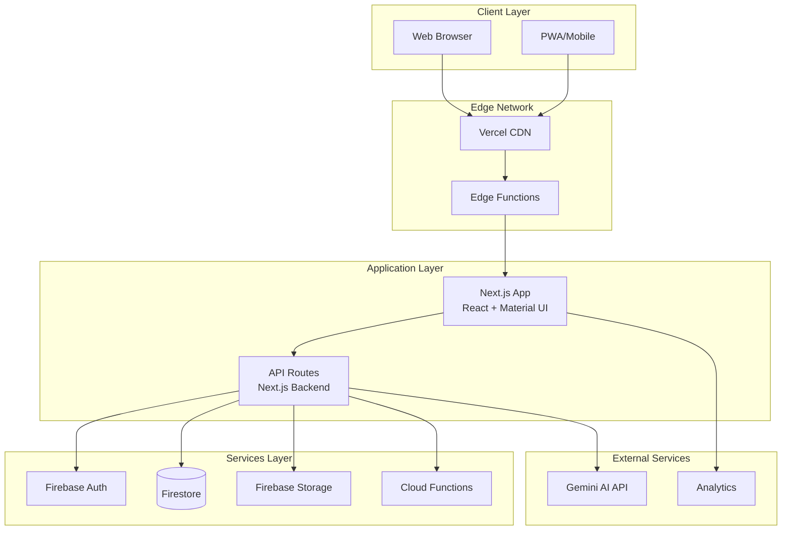
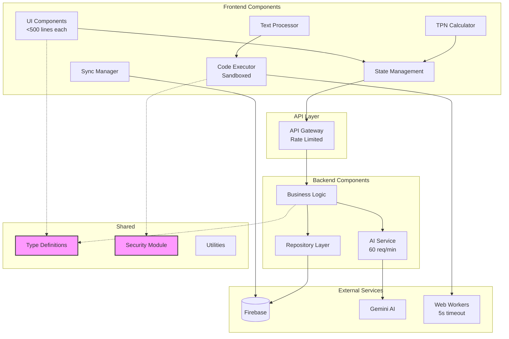
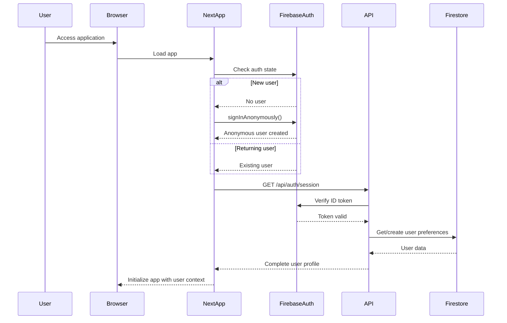
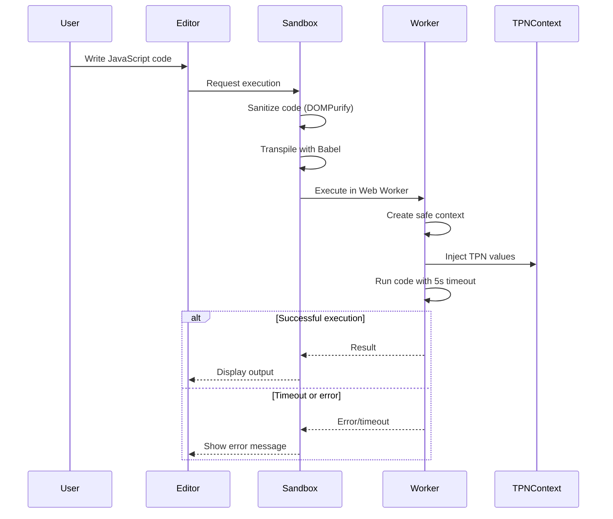
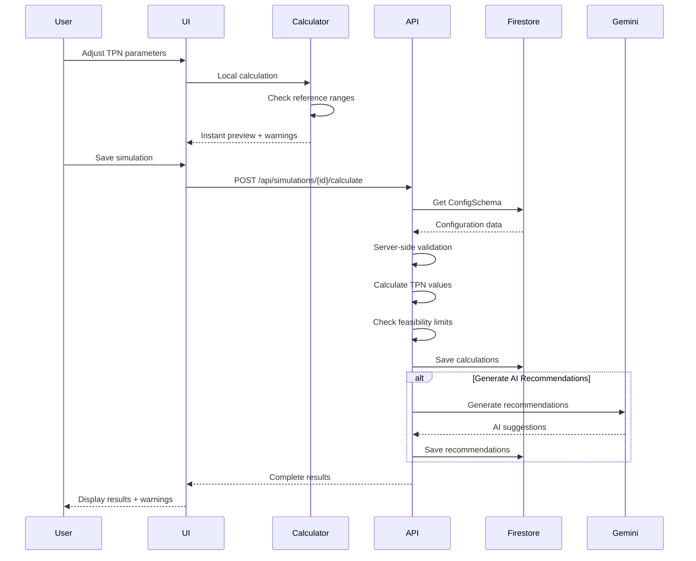
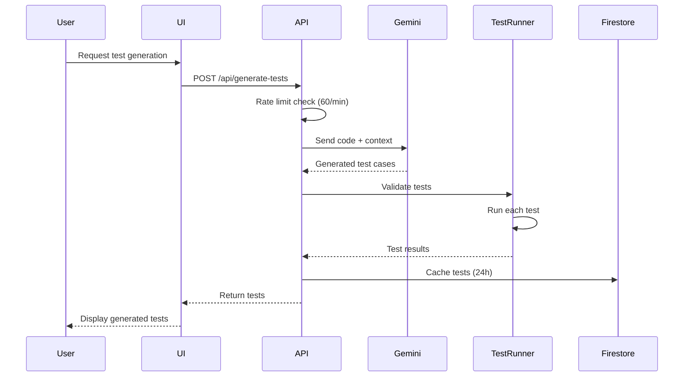
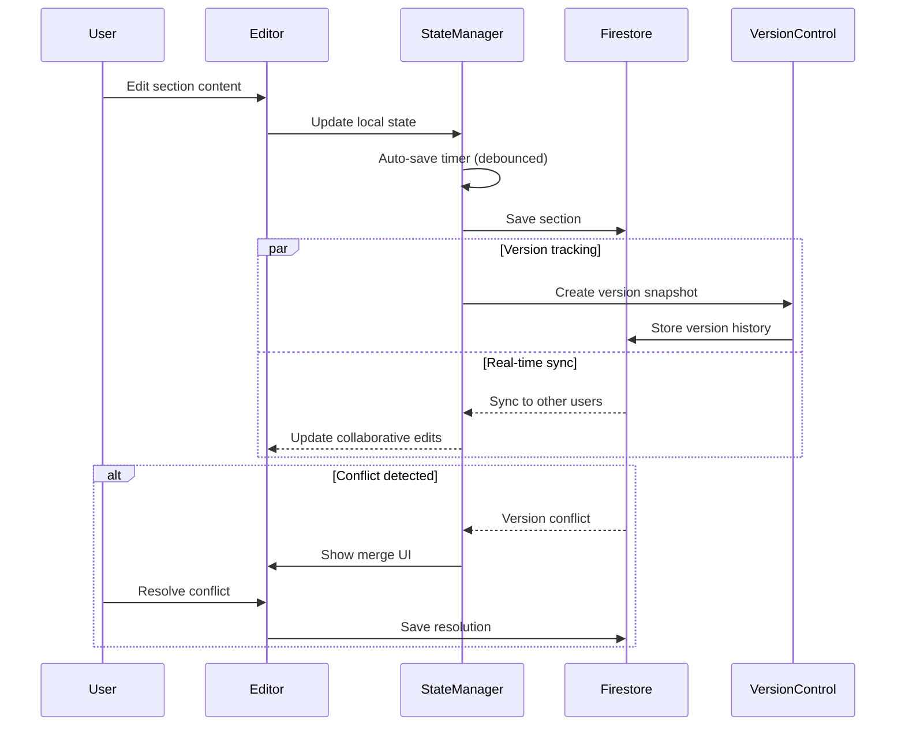
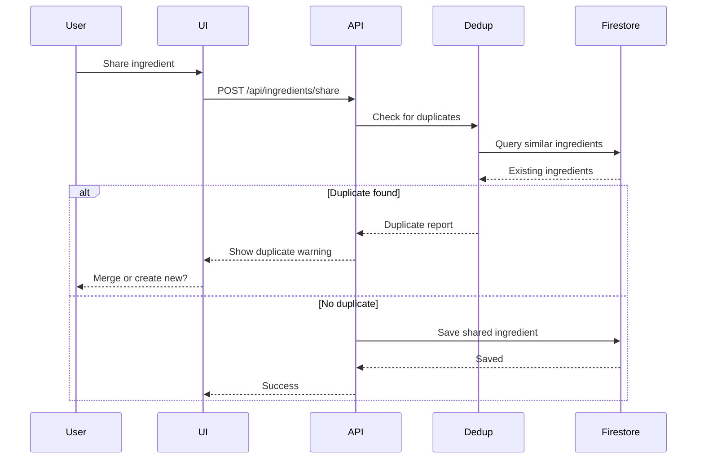

# Dynamic Text Next Fullstack Architecture Document

## Introduction

This document outlines the complete fullstack architecture for **Dynamic Text Next**, including backend systems, frontend implementation, and their integration. It serves as the single source of truth for AI-driven development, ensuring consistency across the entire technology stack.

This unified approach combines what would traditionally be separate backend and frontend architecture documents, streamlining the development process for modern fullstack applications where these concerns are increasingly intertwined.

### Starter Template or Existing Project
This is a **brownfield migration project** from Svelte 5 to Next.js 15. The project structure and technology choices have been established through the migration process:
- Next.js 15.5.2 with App Router and Turbopack
- Material UI v7 for the design system
- Redux Toolkit for state management
- FSD + Atomic Design architecture pattern
- Existing code structure migrated from Svelte

### Change Log
| Date | Version | Description | Author |
|------|---------|-------------|--------|
| 2025-01-02 | v1.0 | Initial fullstack architecture document | Winston (Architect) |

## High Level Architecture

### Technical Summary
The Dynamic Text Next application employs a **serverless JAMstack architecture** with Next.js 15 serving as the fullstack framework, deployed on Vercel with edge functions for optimal performance. The frontend leverages React with Material UI components organized in an FSD + Atomic Design pattern, while the backend will utilize Next.js API routes and Firebase services for authentication, real-time data, and storage. The architecture prioritizes **rapid iteration, type safety, and scalability** through a monorepo structure with shared TypeScript definitions, enabling seamless frontend-backend integration while maintaining clear separation of concerns. This approach delivers on the PRD goals of creating a specialized TPN advisor application with dynamic text generation capabilities, real-time collaboration features, and healthcare-grade data management.

### Platform and Infrastructure Choice

**Platform:** Vercel + Firebase  
**Key Services:** Vercel (hosting, edge functions), Firebase (Auth, Firestore, Storage, Functions)  
**Deployment Host and Regions:** Vercel Global Edge Network with primary region in US-East, Firebase multi-region (us-central1, us-east1)

### Repository Structure
**Structure:** Monorepo  
**Monorepo Tool:** pnpm workspaces (already in use)  
**Package Organization:** Apps-based structure with shared packages for common code between frontend and API routes

### High Level Architecture Diagram



### Architectural Patterns

- **JAMstack Architecture:** Static generation with dynamic API routes for optimal performance - *Rationale:* Maximizes performance while maintaining dynamic capabilities for TPN calculations
- **Feature-Sliced Design (FSD):** Vertical slice architecture organizing by features/domains - *Rationale:* Enforces clear boundaries and dependencies in a growing healthcare application  
- **Atomic Design Components:** Hierarchical component structure from atoms to organisms - *Rationale:* Ensures UI consistency and reusability across complex medical interfaces
- **Repository Pattern:** Abstract Firestore access behind repository interfaces - *Rationale:* Enables testing and potential future migration from Firebase
- **Backend for Frontend (BFF):** Next.js API routes act as BFF layer - *Rationale:* Optimizes data fetching and protects sensitive medical calculations
- **Event-Driven Updates:** Firebase real-time listeners for collaborative features - *Rationale:* Enables real-time collaboration on TPN protocols
- **Edge Computing:** Utilize Vercel Edge Functions for low-latency operations - *Rationale:* Improves performance for global healthcare providers
- **Optimistic UI Updates:** Update UI before server confirmation with rollback - *Rationale:* Provides responsive experience for data entry
- **Command Query Separation:** Separate read/write operations in API design - *Rationale:* Clarifies intent and enables different optimization strategies

## Tech Stack

This is the **DEFINITIVE** technology selection for the entire project. All development must use these exact versions.

### Technology Stack Table

| Category | Technology | Version | Purpose | Rationale |
|----------|------------|---------|---------|-----------|
| Frontend Language | TypeScript | 5.7+ | Type-safe development | Already in use, prevents runtime errors in medical calculations |
| Frontend Framework | Next.js | 15.5.2 | React framework with SSR/SSG | Already implemented, provides fullstack capabilities |
| UI Component Library | Material UI | 7.3.2 | Design system components | Already integrated, comprehensive healthcare-appropriate UI |
| State Management | Redux Toolkit | 2.8.2 | Global state management | Already implemented, predictable state for complex forms |
| Backend Language | TypeScript | 5.7+ | Type-safe backend development | Share types with frontend, consistency |
| Backend Framework | Next.js API Routes | 15.5.2 | Serverless API endpoints | Built into Next.js, automatic scaling |
| API Style | REST | - | HTTP/JSON APIs | Simple, well-understood, adequate for requirements |
| Database | Firestore | Latest | NoSQL document database | Real-time sync, offline support, scales automatically |
| Cache | Vercel Edge Cache | - | CDN and compute caching | Built-in with Vercel, automatic optimization |
| File Storage | Firebase Storage | Latest | Binary file storage | Integrated with Firebase, handles medical documents |
| Authentication | Firebase Auth | Latest | User authentication | Comprehensive auth with healthcare-appropriate security |
| Frontend Testing | Vitest | 3.2.4 | Unit testing framework | Already configured, fast and compatible |
| Backend Testing | Vitest | 3.2.4 | API testing framework | Consistent with frontend, supports async |
| E2E Testing | Playwright | Latest | End-to-end testing | Modern, reliable, good debugging |
| Build Tool | Turbopack | Built-in | Fast bundling | Integrated with Next.js 15 |
| Bundler | Turbopack | Built-in | Module bundling | Next.js 15 default, faster than Webpack |
| IaC Tool | Vercel CLI | Latest | Infrastructure config | Simple JSON config for Vercel |
| CI/CD | GitHub Actions | - | Continuous integration | Free for public repos, Vercel integration |
| Monitoring | Vercel Analytics | Latest | Performance monitoring | Built-in with Vercel, Real User Metrics |
| Logging | Vercel Logs | Latest | Application logging | Integrated platform logging |
| CSS Framework | Tailwind CSS | 4.0 | Utility-first CSS | Already configured, works with Material UI |

## Data Models

Define the core data models/entities that will be shared between frontend and backend for the Dynamic Text Next TPN application, aligned with the parent project's type system.

**Important Note:** This application is designed to be **PHI-free**. All patient data will be anonymous or simulated for testing purposes. No real patient information will be stored.

### Core Types (Aligned with Parent Project)

#### Section and Test Types
```typescript
// From parent project types/section.ts
export interface TestCase {
  name: string;
  variables: Record<string, any>;
  expected: string;
  matchType: 'exact' | 'contains' | 'regex' | 'styles';
  expectedStyles?: Record<string, any>;
}

export interface Section {
  id: number;
  type: 'static' | 'dynamic';
  name: string;
  content: string;
  testCases: TestCase[];
}

export interface TestResult {
  passed: boolean;
  actual?: string;
  expected?: string;
  error?: string;
  testCase: TestCase;
}

export interface SectionTestResult {
  sectionId: number;
  sectionName: string;
  results: TestResult[];
}

export interface TestSummary {
  sections: SectionTestResult[];
  summary: {
    total: number;
    passed: number;
    failed: number;
  };
}
```

#### TPN Types
```typescript
// From parent project types/tpn.ts
export type TPNAdvisorType = 'NEO' | 'CHILD' | 'ADOLESCENT' | 'ADULT';

export type TPNAdvisorAlias = 'neonatal' | 'child' | 'adolescent' | 'adult' | 'infant';

export interface TPNAdvisorMapping {
  readonly NEO: 'neonatal' | 'infant';
  readonly CHILD: 'child';
  readonly ADOLESCENT: 'adolescent';
  readonly ADULT: 'adult';
}

export interface TPNInstance {
  values: Record<string, any>;
  advisorType?: TPNAdvisorType;
}

export interface TPNValues {
  [key: string]: any;
}

export interface MockMeInterface {
  getValue: (key: string) => any;
  maxP: (value: number, precision?: number) => string;
  calculate?: (expression: string) => any;
}
```

#### Workspace Types
```typescript
// From parent project types/workspace.ts
export interface LoadedIngredient {
  id?: string;
  name: string;
  // Extended for Next.js version
  keyname?: string;
  type?: 'Macronutrient' | 'Micronutrient' | 'Additive' | 'Salt' | 'Diluent' | 'Other';
  referenceRanges?: ReferenceRange[];
}

export interface LoadedReference {
  id: string;
  name?: string;
  healthSystem?: string;
  populationType?: string;
  validationStatus?: 'untested' | 'passed' | 'failed' | 'partial';
  validationNotes?: string;
  validatedBy?: string;
  validatedAt?: string | Date;
  updatedAt?: string | Date;
  version?: string;
  sections?: Section[];
}

export interface ValidationData {
  status: 'untested' | 'passed' | 'failed' | 'partial';
  notes: string;
  validatedBy: string | null;
  validatedAt: Date | null;
}
```

### User
**Purpose:** Represents authenticated users including healthcare providers, nutritionists, and administrators

**Key Attributes:**
- id: string - Unique Firebase Auth UID
- email: string - User's email address
- displayName: string - User's display name
- role: UserRole - User's role (provider, nutritionist, admin)
- organization?: string - Optional organization name
- createdAt: Timestamp - Account creation date
- lastLogin: Timestamp - Last login timestamp
- preferences: UserPreferences - UI and app preferences

#### TypeScript Interface:
```typescript
interface User {
  id: string;
  email: string;
  displayName: string;
  role: 'provider' | 'nutritionist' | 'admin' | 'tester';
  organization?: string;
  createdAt: Timestamp;
  lastLogin: Timestamp;
  preferences: UserPreferences;
}

interface UserPreferences {
  theme: 'light' | 'dark' | 'system';
  defaultUnits: 'metric' | 'imperial';
  language: string;
  notifications: boolean;
  defaultAdvisorType?: TPNAdvisorType;
}
```

#### Relationships:
- Has many DynamicTextTemplates (author)
- Has many TPNSimulations (creator)
- Has many TestScenarios (owner)

### DynamicTextTemplate
**Purpose:** Stores reusable templates for dynamic text generation with variables and logic

**Key Attributes:**
- id: string - Unique template identifier
- title: string - Template name
- description: string - Template purpose/description
- content: string - Template content with variables
- variables: Variable[] - Defined variables
- logic: LogicRule[] - Conditional logic rules
- category: string - Template category
- authorId: string - Creator's user ID
- version: number - Template version
- isPublic: boolean - Shareable with community
- tags: string[] - Searchable tags
- createdAt: Timestamp - Creation date
- updatedAt: Timestamp - Last modified date

#### TypeScript Interface:
```typescript
interface DynamicTextTemplate {
  id: string;
  title: string;
  description: string;
  content: string;
  variables: Variable[];
  logic: LogicRule[];
  category: 'clinical' | 'educational' | 'research' | 'testing' | 'other';
  authorId: string;
  version: number;
  isPublic: boolean;
  tags: string[];
  sections?: Section[]; // Can contain multiple sections
  testCases?: TestCase[]; // Associated test cases
  createdAt: Timestamp;
  updatedAt: Timestamp;
}

interface Variable {
  name: string;
  type: 'text' | 'number' | 'date' | 'boolean' | 'select';
  defaultValue?: any;
  options?: string[]; // For select type
  required: boolean;
  validation?: ValidationRule;
  description?: string;
}

interface LogicRule {
  condition: string; // Expression to evaluate
  action: 'show' | 'hide' | 'setValue' | 'calculate';
  target: string; // Variable or section name
  value?: any;
}
```

#### Relationships:
- Belongs to User (author)
- Used by many GeneratedDocuments

### TPNSimulation
**Purpose:** Stores TPN calculation scenarios for testing and education (no real patient data)

**Key Attributes:**
- id: string - Unique simulation identifier
- name: string - Simulation/scenario name
- description: string - Purpose of simulation
- patientProfile: SimulatedPatient - Anonymous patient parameters
- status: string - Simulation status
- parameters: TPNParameters - Nutrition parameters
- calculations: TPNCalculations - Calculated values
- recommendations: string[] - AI-generated recommendations
- creatorId: string - User who created simulation
- isTemplate: boolean - Can be used as template
- tags: string[] - Categorization tags
- createdAt: Timestamp - Creation timestamp
- updatedAt: Timestamp - Last update timestamp

#### TypeScript Interface:
```typescript
interface TPNSimulation {
  id: string;
  name: string;
  description: string;
  configSchemaId: string; // Reference to ConfigSchema used
  patientProfile: SimulatedPatient;
  status: 'draft' | 'complete' | 'archived';
  parameters: TPNParameters;
  calculations: TPNCalculations;
  ingredientSelections: IngredientSelection[]; // Actual selected ingredients
  recommendations: string[];
  advisorType: TPNAdvisorType; // From parent project
  creatorId: string;
  isTemplate: boolean;
  tags: string[];
  sharedWith?: string[]; // User IDs for collaboration
  sections?: Section[]; // Dynamic sections from parent
  testSummary?: TestSummary; // Test results
  createdAt: Timestamp;
  updatedAt: Timestamp;
}

interface SimulatedPatient {
  identifier: string; // Like "Patient A" or "Case 1"
  age: number;
  gender: 'male' | 'female' | 'other';
  weight: number; // kg
  height: number; // cm
  bmi?: number;
  clinicalScenario: string; // Text description
  conditions: string[]; // List of conditions
  medications?: string[]; // Optional medication list
  advisorType: TPNAdvisorType; // NEO, CHILD, ADOLESCENT, ADULT
}

interface TPNParameters {
  weight: number; // kg
  height: number; // cm
  age: number;
  gender: 'male' | 'female';
  stressFactor: number;
  proteinRequirement: number; // g/kg/day
  lipidPercentage: number;
  targetCalories?: number;
  customFactors?: Record<string, number>;
}

interface TPNCalculations {
  totalCalories: number;
  proteinGrams: number;
  carbGrams: number;
  lipidGrams: number;
  totalVolume: number; // ml
  osmolarity: number;
  micronutrients?: Record<string, number>;
  warnings: string[];
  notes: string[];
}
```

#### Relationships:
- Belongs to User (creator)
- Can be shared with other Users
- Has many TPNRevisions (version history)

### TestScenario
**Purpose:** Stores test cases and scenarios for validating TPN calculations and templates

**Key Attributes:**
- id: string - Unique scenario identifier
- title: string - Scenario title
- description: string - What this tests
- type: string - Type of test scenario
- inputData: Record<string, any> - Test inputs
- expectedOutputs: Record<string, any> - Expected results
- actualOutputs?: Record<string, any> - Actual results from last run
- status: string - Test status
- ownerId: string - Creator ID
- isPublic: boolean - Available to all users
- createdAt: Timestamp - Creation date
- lastRun?: Timestamp - Last execution date

#### TypeScript Interface:
```typescript
interface TestScenario {
  id: string;
  title: string;
  description: string;
  type: 'tpn_calculation' | 'template_generation' | 'logic_validation' | 'integration';
  inputData: Record<string, any>;
  expectedOutputs: Record<string, any>;
  actualOutputs?: Record<string, any>;
  status: 'pending' | 'passing' | 'failing' | 'skipped';
  ownerId: string;
  isPublic: boolean;
  tags: string[];
  createdAt: Timestamp;
  lastRun?: Timestamp;
}
```

#### Relationships:
- Belongs to User (owner)
- References TPNSimulation or DynamicTextTemplate

### GeneratedDocument
**Purpose:** Stores documents generated from templates with filled variables

**Key Attributes:**
- id: string - Unique document identifier
- templateId: string - Source template ID
- simulationId?: string - Associated TPN simulation
- title: string - Document title
- content: string - Generated content
- variables: Record<string, any> - Variable values used
- generatorId: string - User who generated
- purpose: string - Purpose of generation
- createdAt: Timestamp - Generation timestamp

#### TypeScript Interface:
```typescript
interface GeneratedDocument {
  id: string;
  templateId: string;
  simulationId?: string;
  title: string;
  content: string;
  variables: Record<string, any>;
  generatorId: string;
  purpose: 'testing' | 'educational' | 'documentation' | 'export';
  metadata?: {
    renderTime: number; // ms
    templateVersion: number;
    warnings?: string[];
  };
  createdAt: Timestamp;
}
```

#### Relationships:
- Belongs to DynamicTextTemplate
- Belongs to User (generator)
- Optionally belongs to TPNSimulation

### ConfigSchema
**Purpose:** Stores TPN ingredient and calculation configurations imported from the schema.json

**Key Attributes:**
- id: string - Unique configuration identifier
- name: string - Configuration set name
- version: string - Schema version
- ingredients: Ingredient[] - TPN ingredients configuration
- flexSettings: FlexSetting[] - Flexible configuration parameters
- creatorId: string - User who created/imported
- isDefault: boolean - Default configuration flag
- isActive: boolean - Currently active configuration
- createdAt: Timestamp - Import/creation date
- updatedAt: Timestamp - Last modification

#### TypeScript Interface:
```typescript
interface ConfigSchema {
  id: string;
  name: string;
  version: string;
  ingredients: Ingredient[];
  flexSettings: FlexSetting[];
  creatorId: string;
  isDefault: boolean;
  isActive: boolean;
  description?: string;
  createdAt: Timestamp;
  updatedAt: Timestamp;
}

interface Ingredient {
  keyname: string;
  display: string;
  mnemonic: string;
  uomDisplay: string;
  type: 'Macronutrient' | 'Micronutrient' | 'Additive' | 'Salt' | 'Diluent' | 'Other';
  osmoRatio?: number;
  editMode: 'None' | 'Custom';
  precision: number;
  special?: string;
  notes?: Note[];
  altUOM?: AlternateUOM[];
  referenceRanges?: ReferenceRange[];
  labs?: LabReference[];
  concentration?: Concentration;
  excludes?: string[]; // Keynames to exclude
}

interface Note {
  text: string;
}

interface AlternateUOM {
  name: string;
  uomDisplay: string;
}

interface ReferenceRange {
  threshold: 'Feasible Low' | 'Critical Low' | 'Normal Low' | 'Normal High' | 'Critical High' | 'Feasible High';
  value: number;
}

interface LabReference {
  display: string;
  eventSetName: string;
  graph: boolean;
}

interface Concentration {
  strength: number;
  strengthUOM: string;
  volume: number;
  volumeUOM: string;
}

interface FlexSetting {
  name: string;
  value: string;
  configComment?: string;
  altValues?: AlternativeValue[];
}

interface AlternativeValue {
  checkType: 'Facility' | string;
  checkMatch: string;
  overrideValue: string;
}
```

#### Relationships:
- Belongs to User (creator)
- Used by many TPNSimulations
- Can have multiple versions (versioning history)

## API Specification

Based on the REST API style chosen in the Tech Stack, here's the OpenAPI 3.0 specification for the Dynamic Text Next API:

### REST API Specification

```yaml
openapi: 3.0.0
info:
  title: Dynamic Text Next API
  version: 1.0.0
  description: API for TPN simulation, dynamic text generation, and configuration management
servers:
  - url: https://api.dynamic-text-next.vercel.app/api
    description: Production API
  - url: http://localhost:3000/api
    description: Development server

components:
  securitySchemes:
    firebaseAuth:
      type: http
      scheme: bearer
      bearerFormat: JWT
      description: Firebase ID token
  
  schemas:
    User:
      type: object
      required: [id, email, displayName, role]
      properties:
        id:
          type: string
        email:
          type: string
        displayName:
          type: string
        role:
          type: string
          enum: [provider, nutritionist, admin, tester]
        organization:
          type: string
        preferences:
          $ref: '#/components/schemas/UserPreferences'
    
    ConfigSchema:
      type: object
      required: [id, name, version, ingredients, flexSettings]
      properties:
        id:
          type: string
        name:
          type: string
        version:
          type: string
        ingredients:
          type: array
          items:
            $ref: '#/components/schemas/Ingredient'
        flexSettings:
          type: array
          items:
            $ref: '#/components/schemas/FlexSetting'
    
    TPNSimulation:
      type: object
      required: [name, configSchemaId, patientProfile, parameters]
      properties:
        id:
          type: string
        name:
          type: string
        description:
          type: string
        configSchemaId:
          type: string
        patientProfile:
          $ref: '#/components/schemas/SimulatedPatient'
        parameters:
          $ref: '#/components/schemas/TPNParameters'
        calculations:
          $ref: '#/components/schemas/TPNCalculations'
        ingredientSelections:
          type: array
          items:
            $ref: '#/components/schemas/IngredientSelection'
    
    DynamicTextTemplate:
      type: object
      required: [title, content, variables]
      properties:
        id:
          type: string
        title:
          type: string
        description:
          type: string
        content:
          type: string
        variables:
          type: array
          items:
            $ref: '#/components/schemas/Variable'
        logic:
          type: array
          items:
            $ref: '#/components/schemas/LogicRule'
        category:
          type: string
          enum: [clinical, educational, research, testing, other]
        isPublic:
          type: boolean
        tags:
          type: array
          items:
            type: string

paths:
  /auth/session:
    get:
      summary: Get current user session
      security:
        - firebaseAuth: []
      responses:
        '200':
          description: Current user session
          content:
            application/json:
              schema:
                $ref: '#/components/schemas/User'
        '401':
          description: Unauthorized
  
  /config-schemas:
    get:
      summary: List available configuration schemas
      security:
        - firebaseAuth: []
      parameters:
        - in: query
          name: active
          schema:
            type: boolean
          description: Filter for active schemas only
      responses:
        '200':
          description: List of configuration schemas
          content:
            application/json:
              schema:
                type: array
                items:
                  $ref: '#/components/schemas/ConfigSchema'
    
    post:
      summary: Import or create a configuration schema
      security:
        - firebaseAuth: []
      requestBody:
        required: true
        content:
          application/json:
            schema:
              $ref: '#/components/schemas/ConfigSchema'
      responses:
        '201':
          description: Schema created
          content:
            application/json:
              schema:
                $ref: '#/components/schemas/ConfigSchema'
  
  /config-schemas/{id}:
    get:
      summary: Get specific configuration schema
      security:
        - firebaseAuth: []
      parameters:
        - in: path
          name: id
          required: true
          schema:
            type: string
      responses:
        '200':
          description: Configuration schema details
          content:
            application/json:
              schema:
                $ref: '#/components/schemas/ConfigSchema'
    
    put:
      summary: Update configuration schema
      security:
        - firebaseAuth: []
      parameters:
        - in: path
          name: id
          required: true
          schema:
            type: string
      requestBody:
        required: true
        content:
          application/json:
            schema:
              $ref: '#/components/schemas/ConfigSchema'
      responses:
        '200':
          description: Schema updated
  
  /simulations:
    get:
      summary: List TPN simulations
      security:
        - firebaseAuth: []
      parameters:
        - in: query
          name: creatorId
          schema:
            type: string
        - in: query
          name: sharedWith
          schema:
            type: string
        - in: query
          name: tags
          schema:
            type: array
            items:
              type: string
      responses:
        '200':
          description: List of simulations
          content:
            application/json:
              schema:
                type: array
                items:
                  $ref: '#/components/schemas/TPNSimulation'
    
    post:
      summary: Create new TPN simulation
      security:
        - firebaseAuth: []
      requestBody:
        required: true
        content:
          application/json:
            schema:
              $ref: '#/components/schemas/TPNSimulation'
      responses:
        '201':
          description: Simulation created
          content:
            application/json:
              schema:
                $ref: '#/components/schemas/TPNSimulation'
  
  /simulations/{id}:
    get:
      summary: Get specific simulation
      security:
        - firebaseAuth: []
      parameters:
        - in: path
          name: id
          required: true
          schema:
            type: string
      responses:
        '200':
          description: Simulation details
    
    put:
      summary: Update simulation
      security:
        - firebaseAuth: []
      parameters:
        - in: path
          name: id
          required: true
          schema:
            type: string
      requestBody:
        required: true
        content:
          application/json:
            schema:
              $ref: '#/components/schemas/TPNSimulation'
      responses:
        '200':
          description: Simulation updated
    
    delete:
      summary: Delete simulation
      security:
        - firebaseAuth: []
      parameters:
        - in: path
          name: id
          required: true
          schema:
            type: string
      responses:
        '204':
          description: Simulation deleted
  
  /simulations/{id}/calculate:
    post:
      summary: Run TPN calculations
      security:
        - firebaseAuth: []
      parameters:
        - in: path
          name: id
          required: true
          schema:
            type: string
      requestBody:
        required: true
        content:
          application/json:
            schema:
              type: object
              properties:
                parameters:
                  $ref: '#/components/schemas/TPNParameters'
                ingredientSelections:
                  type: array
                  items:
                    $ref: '#/components/schemas/IngredientSelection'
      responses:
        '200':
          description: Calculation results
          content:
            application/json:
              schema:
                $ref: '#/components/schemas/TPNCalculations'
  
  /simulations/{id}/recommendations:
    post:
      summary: Generate AI recommendations
      security:
        - firebaseAuth: []
      parameters:
        - in: path
          name: id
          required: true
          schema:
            type: string
      responses:
        '200':
          description: AI-generated recommendations
          content:
            application/json:
              schema:
                type: object
                properties:
                  recommendations:
                    type: array
                    items:
                      type: string
                  warnings:
                    type: array
                    items:
                      type: string
  
  /templates:
    get:
      summary: List dynamic text templates
      security:
        - firebaseAuth: []
      parameters:
        - in: query
          name: category
          schema:
            type: string
        - in: query
          name: isPublic
          schema:
            type: boolean
        - in: query
          name: authorId
          schema:
            type: string
      responses:
        '200':
          description: List of templates
    
    post:
      summary: Create new template
      security:
        - firebaseAuth: []
      requestBody:
        required: true
        content:
          application/json:
            schema:
              $ref: '#/components/schemas/DynamicTextTemplate'
      responses:
        '201':
          description: Template created
  
  /templates/{id}/generate:
    post:
      summary: Generate document from template
      security:
        - firebaseAuth: []
      parameters:
        - in: path
          name: id
          required: true
          schema:
            type: string
      requestBody:
        required: true
        content:
          application/json:
            schema:
              type: object
              properties:
                variables:
                  type: object
                  additionalProperties: true
                simulationId:
                  type: string
      responses:
        '200':
          description: Generated document
          content:
            application/json:
              schema:
                type: object
                properties:
                  content:
                    type: string
                  metadata:
                    type: object
  
  /test-scenarios:
    get:
      summary: List test scenarios
      security:
        - firebaseAuth: []
      parameters:
        - in: query
          name: type
          schema:
            type: string
        - in: query
          name: status
          schema:
            type: string
      responses:
        '200':
          description: List of test scenarios
    
    post:
      summary: Create test scenario
      security:
        - firebaseAuth: []
      requestBody:
        required: true
        content:
          application/json:
            schema:
              $ref: '#/components/schemas/TestScenario'
      responses:
        '201':
          description: Test scenario created
  
  /test-scenarios/{id}/run:
    post:
      summary: Execute test scenario
      security:
        - firebaseAuth: []
      parameters:
        - in: path
          name: id
          required: true
          schema:
            type: string
      responses:
        '200':
          description: Test execution results
          content:
            application/json:
              schema:
                type: object
                properties:
                  status:
                    type: string
                    enum: [passing, failing]
                  actualOutputs:
                    type: object
                  expectedOutputs:
                    type: object
                  differences:
                    type: array
                    items:
                      type: object
```

## Components

Based on the architectural patterns, tech stack, and data models, here are the major logical components across the fullstack:

### Frontend Components

#### UI Component Library
**Responsibility:** Reusable UI components following Atomic Design principles integrated with Material UI

**Key Interfaces:**
- Atom components (Button, Input, Label, Icon)
- Molecule components (FormField, Card, Alert, SearchInput)
- Organism components (Header, Sidebar, DataTable, Navigation)
- Template layouts (DashboardLayout, EditorLayout, AuthLayout)

**Dependencies:** Material UI, Tailwind CSS, React

**Technology Stack:** TypeScript, React 18, Material UI 7.3.2, Tailwind CSS 4

**Size Constraint:** Each component must be <500 lines (following parent project pattern)

#### State Management Layer
**Responsibility:** Global state management for application data and UI state

**Key Interfaces:**
- Redux stores (auth, simulations, templates, config, sections)
- Thunks for async operations
- Selectors for derived state
- RTK Query for API caching

**Dependencies:** Redux Toolkit, Firebase Auth

**Technology Stack:** Redux Toolkit 2.8.2, RTK Query

#### TPN Calculator Engine
**Responsibility:** Client-side TPN calculations and validation

**Key Interfaces:**
- `calculateTPN(parameters, ingredients, config): TPNCalculations`
- `validateIngredients(selections, config): ValidationResult`
- `checkReferenceRanges(calculations, config): Warning[]`
- `getTPNValue(key: string): number`
- `hasTPNValue(key: string): boolean`

**Dependencies:** ConfigSchema model, shared types

**Technology Stack:** TypeScript, Web Workers for heavy calculations

#### Dynamic Text Processor  
**Responsibility:** Process templates and generate dynamic text with sandboxed JavaScript execution

**Key Interfaces:**
- `processTemplate(template, variables): string`
- `evaluateLogic(rules, context): LogicResult`
- `validateVariables(template, inputs): ValidationResult`
- `executeInSandbox(code, context): Promise<Result>`

**Dependencies:** Template models, logic evaluator, Babel standalone

**Technology Stack:** TypeScript, Web Workers, Babel for transpilation

#### Secure Code Executor
**Responsibility:** Safely execute user-provided JavaScript code in isolation (critical from parent project)

**Key Interfaces:**
```typescript
class SecureExecutor {
  async execute(code: string, context: TPNContext): Promise<Result>
  transpile(code: string): string  // Babel transpilation
  sanitizeContext(context: any): SafeContext
  validateCode(code: string): ValidationResult
}
```

**Dependencies:** Web Workers, Babel, DOMPurify

**Technology Stack:** Web Workers with 5s timeout, Babel standalone, DOMPurify for sanitization

#### Real-time Sync Manager
**Responsibility:** Manage Firebase real-time subscriptions and offline sync

**Key Interfaces:**
- `subscribeToSimulation(id, callback)`
- `syncOfflineChanges()`
- `handleConflicts(local, remote): Resolution`
- `subscribeToSharedIngredients(callback)`

**Dependencies:** Firebase Firestore, Redux store

**Technology Stack:** Firebase SDK, IndexedDB for offline storage

### Backend Components

#### API Gateway
**Responsibility:** Route requests, validate auth, enforce rate limits

**Key Interfaces:**
- Authentication middleware
- Rate limiting middleware (60 req/min for AI endpoints)
- Request validation
- Error handling
- CORS configuration

**Dependencies:** Firebase Admin SDK, Next.js API routes

**Technology Stack:** Next.js 15 API Routes, Firebase Admin

#### Business Logic Service
**Responsibility:** Core business operations and orchestration

**Key Interfaces:**
- `SimulationService`: CRUD operations for simulations
- `TemplateService`: Template management
- `ConfigService`: Configuration management
- `CalculationService`: Server-side TPN calculations
- `SectionService`: Section management with versioning
- `IngredientService`: Ingredient sharing and deduplication

**Dependencies:** Repository layer, Firebase services

**Technology Stack:** TypeScript, Next.js API routes

#### Repository Layer
**Responsibility:** Abstract data access and provide consistent interface

**Key Interfaces:**
- `ISimulationRepository`
- `ITemplateRepository`
- `IConfigRepository`
- `IUserRepository`
- `ISectionRepository`
- `IIngredientRepository`

**Dependencies:** Firebase Firestore, Firebase Storage

**Technology Stack:** Firebase Admin SDK, TypeScript interfaces

#### AI Integration Service
**Responsibility:** Interface with Gemini AI for test generation and recommendations

**Key Interfaces:**
- `generateTests(code, sectionName, context): TestCase[]`
- `generateRecommendations(simulation): Recommendations`
- `enhanceTemplate(template, context): EnhancedTemplate`
- `analyzeCalculations(tpn): Analysis`

**Dependencies:** Gemini API, Business Logic Service

**Technology Stack:** Google AI SDK, TypeScript, rate limiting

### Shared Components

#### Type Definitions Package
**Responsibility:** Shared TypeScript interfaces and types

**Key Interfaces:**
- All data model interfaces
- API request/response types
- Validation schemas
- Constants and enums
- TPN context types

**Dependencies:** None (pure TypeScript)

**Technology Stack:** TypeScript 5.7+

#### Security Module
**Responsibility:** Input sanitization and security utilities (critical from parent)

**Key Interfaces:**
```typescript
function sanitizeHTML(html: string): string  // DOMPurify
function sanitizeCode(code: string): string
function validateInput(input: any, schema: Schema): boolean
function escapeUserContent(content: string): string
```

**Dependencies:** DOMPurify, validation libraries

**Technology Stack:** DOMPurify with strict config, zod for validation

### Component Interaction Diagram



## External APIs

For the Dynamic Text Next application, here are the external service integrations required:

### Firebase Services API
- **Purpose:** Backend-as-a-Service for authentication, database, storage, and real-time features
- **Documentation:** https://firebase.google.com/docs/reference
- **Base URL(s):** Project-specific Firebase endpoints
- **Authentication:** Firebase Admin SDK with service account credentials
- **Rate Limits:** Firestore: 1M reads/day free tier, 10K writes/sec per database

**Key Endpoints Used:**
- `Firebase Auth` - User authentication (anonymous sign-in support)
- `Firestore Database` - Document storage and real-time subscriptions
- `Firebase Storage` - File uploads and ingredient versioning
- `Firebase Cloud Messaging` - Push notifications (future)

**Integration Notes:** Initialize once at app startup, use Admin SDK on backend only, implement exponential backoff for retries, enable offline persistence

### Google Gemini AI API
- **Purpose:** AI-powered test generation, recommendations, and TPN analysis
- **Documentation:** https://ai.google.dev/docs
- **Base URL(s):** https://generativelanguage.googleapis.com/v1
- **Authentication:** API key authentication
- **Rate Limits:** 60 requests per minute (enforced at application level)

**Key Endpoints Used:**
- `POST /models/gemini-pro:generateContent` - Generate tests from code sections
- `POST /models/gemini-pro:streamGenerateContent` - Stream responses for better UX

**Integration Notes:** Implement request queuing, cache test results for 24h, use streaming for long responses, graceful fallback on API failures

### Vercel Analytics API
- **Purpose:** Performance monitoring and usage analytics
- **Documentation:** https://vercel.com/docs/analytics
- **Base URL(s):** Automatically configured via Vercel deployment
- **Authentication:** Automatic via Vercel deployment
- **Rate Limits:** No explicit limits for analytics collection

**Key Endpoints Used:**
- Auto-injected client-side tracking
- Web Vitals collection (target: LCP <2.5s, FID <100ms, CLS <0.1)
- Custom events for feature usage tracking

**Integration Notes:** Automatically enabled with Vercel deployment, monitor bundle size impact, track TPN calculation performance

## Core Workflows

Illustrating key system workflows using sequence diagrams:

### User Authentication Flow



### Dynamic Code Execution Flow (Critical from Parent)



### TPN Simulation Calculation Flow



### Test Generation Flow



### Section Content Management Flow



### Ingredient Sharing Workflow



## Database Schema

Transform the conceptual data models into concrete Firestore database schemas:

### Firestore Collections Structure

```typescript
// Collection: users
{
  id: "firebase_auth_uid",
  email: "user@example.com",
  displayName: "John Doe",
  role: "provider", // provider | nutritionist | admin | tester
  organization: "General Hospital",
  createdAt: Timestamp,
  lastLogin: Timestamp,
  preferences: {
    theme: "light",
    defaultUnits: "metric",
    language: "en",
    notifications: true,
    defaultAdvisorType: "ADULT"
  }
}

// Collection: references (from parent project workspace)
{
  id: "auto_generated_id",
  name: "Adult TPN Protocol v2",
  healthSystem: "General Hospital",
  populationType: "adult",
  validationStatus: "passed", // untested | passed | failed | partial
  validationNotes: "Validated against current guidelines",
  validatedBy: "user_id",
  validatedAt: Timestamp,
  updatedAt: Timestamp,
  version: "2.0",
  creatorId: "user_id",
  
  // Subcollection: references/{id}/sections
  sections: [
    {
      id: 1,
      type: "dynamic", // static | dynamic
      name: "TPN Calculations",
      content: "// JavaScript code for calculations",
      testCases: [
        {
          name: "Standard adult case",
          variables: { weight: 70, height: 175 },
          expected: "Expected output",
          matchType: "exact" // exact | contains | regex | styles
        }
      ]
    }
  ]
}

// Collection: ingredients (shared ingredients from parent)
{
  id: "auto_generated_id", 
  keyname: "DEXTROSE",
  name: "Dextrose",
  type: "Macronutrient",
  creatorId: "user_id",
  isShared: true,
  version: 1,
  referenceRanges: [
    {
      threshold: "Normal Low",
      value: 100,
      advisorType: "ADULT"
    }
  ],
  createdAt: Timestamp,
  updatedAt: Timestamp
}

// Collection: tpnSimulations
{
  id: "auto_generated_id",
  name: "Adult TPN Simulation #1",
  description: "Standard adult patient simulation",
  configSchemaId: "config_schema_id",
  advisorType: "ADULT", // NEO | CHILD | ADOLESCENT | ADULT
  creatorId: "user_id",
  status: "complete",
  isTemplate: false,
  tags: ["adult", "standard", "teaching"],
  sharedWith: ["user_id_2", "user_id_3"],
  
  patientProfile: {
    identifier: "Patient A",
    age: 45,
    gender: "male",
    weight: 75,
    height: 180,
    bmi: 23.1,
    clinicalScenario: "Post-operative patient",
    conditions: ["post-op", "malnutrition"],
    advisorType: "ADULT"
  },
  
  // Subcollection: tpnSimulations/{id}/sections
  sections: [
    {
      id: 1,
      type: "dynamic",
      name: "Calculations",
      content: "// Dynamic JS content",
      testCases: []
    }
  ],
  
  testSummary: {
    sections: [],
    summary: {
      total: 10,
      passed: 8,
      failed: 2
    }
  },
  
  createdAt: Timestamp,
  updatedAt: Timestamp
}
```

### Firestore Security Rules

```javascript
rules_version = '2';
service cloud.firestore {
  match /databases/{database}/documents {
    // Helper functions
    function isAuthenticated() {
      return request.auth != null;
    }
    
    function isOwner(resource) {
      return isAuthenticated() && 
        request.auth.uid == resource.data.creatorId;
    }
    
    // Users collection
    match /users/{userId} {
      allow read: if isAuthenticated();
      allow write: if isAuthenticated() && request.auth.uid == userId;
    }
    
    // References collection
    match /references/{refId} {
      allow read: if isAuthenticated();
      allow create: if isAuthenticated();
      allow update, delete: if isOwner(resource);
      
      match /sections/{sectionId} {
        allow read, write: if isAuthenticated() && 
          isOwner(get(/databases/$(database)/documents/references/$(refId)));
      }
    }
    
    // Ingredients collection
    match /ingredients/{ingredientId} {
      allow read: if isAuthenticated();
      allow create: if isAuthenticated();
      allow update, delete: if isOwner(resource) || 
        resource.data.isShared == true;
    }
    
    // TPN Simulations
    match /tpnSimulations/{simId} {
      allow read: if isAuthenticated() && 
        (isOwner(resource) || 
         request.auth.uid in resource.data.sharedWith ||
         resource.data.isTemplate == true);
      allow create: if isAuthenticated();
      allow update, delete: if isOwner(resource);
      
      match /sections/{sectionId} {
        allow read, write: if isAuthenticated() && 
          isOwner(get(/databases/$(database)/documents/tpnSimulations/$(simId)));
      }
    }
  }
}
```

## Frontend Architecture

Define frontend-specific architecture details following FSD + Atomic Design patterns.

### Component Architecture

#### Component Organization (FSD + Atomic)
```
src/
├── app/                    # Next.js App Router + global providers
│   ├── (auth)/            # Auth group routes
│   ├── (dashboard)/       # Dashboard routes
│   ├── api/               # API routes
│   └── layout.tsx         # Root layout
├── pages/                  # FSD Pages layer
│   ├── editor/            # Editor page components
│   ├── simulations/       # Simulations page
│   └── references/        # References management
├── widgets/                # Complex UI sections (<500 lines each)
│   ├── tpn-editor/        # TPN editor widget
│   ├── code-editor/       # Code editor with preview
│   ├── test-panel/        # Test execution panel
│   └── section-manager/   # Section management
├── features/               # Business features
│   ├── tpn-calculations/  # TPN calculation logic
│   ├── code-execution/    # Sandboxed code execution
│   ├── test-generation/   # AI test generation
│   └── versioning/        # Version control
├── entities/               # Business entities
│   ├── section/           # Section entity
│   ├── reference/         # Reference entity
│   ├── ingredient/        # Ingredient entity
│   └── simulation/        # Simulation entity
└── shared/                 # Shared code
    ├── ui/                # Atomic Design components
    │   ├── atoms/         # Basic elements
    │   ├── molecules/     # Component groups
    │   └── organisms/     # Complex sections
    ├── lib/               # Utilities
    ├── hooks/             # Custom React hooks
    └── types/             # TypeScript types

```

#### Component Size Rules (from Parent Project)
- **Maximum 500 lines per component**
- Break down larger components into:
  - Container component (logic)
  - Presentational components (UI)
  - Custom hooks (reusable logic)

### State Management Architecture

#### Redux Store Structure
```typescript
interface RootState {
  auth: AuthState;
  sections: SectionState;
  references: ReferenceState;
  simulations: SimulationState;
  ingredients: IngredientState;
  ui: UIState;
}

// Section state aligned with parent project
interface SectionState {
  sections: Section[];
  activeSectionId: number | null;
  testResults: TestSummary | null;
  isDirty: boolean;
}

// Reference state for workspace
interface ReferenceState {
  references: LoadedReference[];
  activeReferenceId: string | null;
  validationData: ValidationData | null;
}
```

### Routing Architecture

#### Next.js App Router Structure
```
app/
├── (auth)/
│   ├── login/
│   └── register/
├── (dashboard)/
│   ├── page.tsx           # Dashboard home
│   ├── editor/
│   │   └── [id]/
│   │       └── page.tsx   # Editor with reference ID
│   ├── simulations/
│   │   ├── page.tsx       # Simulations list
│   │   └── [id]/
│   │       └── page.tsx   # Simulation details
│   └── references/
│       └── page.tsx       # References management
└── api/
    ├── auth/
    ├── simulations/
    ├── generate-tests/    # AI test generation
    └── sections/
```

### Code Execution Architecture (Critical from Parent)

#### Secure Sandbox Implementation
```typescript
class SecureCodeExecutor {
  private worker: Worker;
  
  async execute(code: string, context: TPNContext): Promise<Result> {
    // 1. Sanitize code
    const sanitized = DOMPurify.sanitize(code);
    
    // 2. Transpile with Babel
    const transpiled = Babel.transform(sanitized, {
      presets: ['env'],
      plugins: ['transform-runtime']
    });
    
    // 3. Create safe context
    const safeContext = {
      values: context.values,
      advisorType: context.advisorType,
      getValue: (key: string) => context.values[key],
      hasValue: (key: string) => key in context.values,
      maxP: (value: number, precision = 2) => value.toFixed(precision)
    };
    
    // 4. Execute in Worker with timeout
    return this.executeInWorker(transpiled, safeContext, 5000);
  }
}
```

## Backend Architecture

Define backend-specific architecture details using Next.js API routes.

### API Route Organization

```
app/api/
├── auth/
│   ├── session/
│   │   └── route.ts       # GET user session
│   └── signout/
│       └── route.ts       # POST sign out
├── simulations/
│   ├── route.ts           # GET list, POST create
│   └── [id]/
│       ├── route.ts       # GET, PUT, DELETE
│       ├── calculate/
│       │   └── route.ts   # POST calculations
│       └── recommendations/
│           └── route.ts   # POST AI recommendations
├── sections/
│   ├── route.ts           # GET, POST sections
│   └── [id]/
│       ├── route.ts       # PUT, DELETE section
│       └── test/
│           └── route.ts   # POST run tests
├── generate-tests/
│   └── route.ts           # POST AI test generation
└── ingredients/
    ├── route.ts           # GET, POST ingredients
    └── share/
        └── route.ts       # POST share ingredient
```

### Middleware Architecture

```typescript
// middleware.ts
import { NextResponse } from 'next/server';
import { verifyIdToken } from '@/lib/firebase-admin';

export async function middleware(request: Request) {
  // Authentication check
  const token = request.headers.get('authorization')?.split('Bearer ')[1];
  
  if (!token) {
    return NextResponse.json({ error: 'Unauthorized' }, { status: 401 });
  }
  
  try {
    const user = await verifyIdToken(token);
    
    // Rate limiting for AI endpoints
    if (request.url.includes('/generate-tests') || 
        request.url.includes('/recommendations')) {
      const rateLimitOk = await checkRateLimit(user.uid, 60); // 60 req/min
      if (!rateLimitOk) {
        return NextResponse.json({ error: 'Rate limit exceeded' }, { status: 429 });
      }
    }
    
    // Add user to request
    request.headers.set('x-user-id', user.uid);
    return NextResponse.next();
  } catch (error) {
    return NextResponse.json({ error: 'Invalid token' }, { status: 401 });
  }
}

export const config = {
  matcher: '/api/((?!auth/session).*)',
};
```

## Security Architecture

### Input Sanitization (from Parent Project)

```typescript
import DOMPurify from 'isomorphic-dompurify';

// HTML Sanitization for static content
export function sanitizeHTML(html: string): string {
  return DOMPurify.sanitize(html, {
    ALLOWED_TAGS: ['p', 'div', 'span', 'h1', 'h2', 'h3', 'b', 'i', 'u', 'br'],
    ALLOWED_ATTR: ['class', 'id', 'style'],
    ALLOW_DATA_ATTR: false
  });
}

// Code sanitization for dynamic execution
export function sanitizeCode(code: string): string {
  // Remove potentially dangerous patterns
  const dangerous = [
    /eval\s*\(/g,
    /Function\s*\(/g,
    /setTimeout\s*\(/g,
    /setInterval\s*\(/g,
    /document\./g,
    /window\./g,
    /process\./g,
    /require\s*\(/g,
    /import\s+/g,
    /export\s+/g
  ];
  
  let sanitized = code;
  dangerous.forEach(pattern => {
    sanitized = sanitized.replace(pattern, '/* blocked */');
  });
  
  return sanitized;
}
```

### Authentication Flow

```typescript
// Anonymous sign-in support (from parent)
async function initializeAuth() {
  const auth = getAuth();
  
  onAuthStateChanged(auth, async (user) => {
    if (!user) {
      // Sign in anonymously for new users
      const credential = await signInAnonymously(auth);
      user = credential.user;
    }
    
    // Store user in Redux
    dispatch(setUser({
      id: user.uid,
      email: user.email || null,
      isAnonymous: user.isAnonymous
    }));
  });
}
```

## Performance Optimization

### Bundle Size Management (Target: <1MB)

```javascript
// next.config.js
module.exports = {
  experimental: {
    optimizePackageImports: ['@mui/material', '@mui/icons-material'],
  },
  webpack: (config) => {
    // Split bundles
    config.optimization.splitChunks = {
      chunks: 'all',
      cacheGroups: {
        mui: {
          test: /[\\/]node_modules[\\/]@mui[\\/]/,
          name: 'mui',
          priority: 10,
        },
        firebase: {
          test: /[\\/]node_modules[\\/]firebase[\\/]/,
          name: 'firebase',
          priority: 10,
        },
        babel: {
          test: /[\\/]node_modules[\\/]@babel[\\/]/,
          name: 'babel',
          priority: 10,
        },
      },
    };
    return config;
  },
};
```

### Performance Targets (from Parent)
- **Initial Load:** <3s on 3G
- **Time to Interactive:** <5s
- **Bundle Size:** <1MB
- **Lighthouse Score:** >80
- **Core Web Vitals:**
  - LCP: <2.5s
  - FID: <100ms
  - CLS: <0.1

### Optimization Strategies
1. **Dynamic imports** for heavy components (CodeMirror, DiffViewer)
2. **Web Workers** for TPN calculations and code execution
3. **React.memo** and **useMemo** for expensive computations
4. **Virtual scrolling** for large lists
5. **Service Worker** for offline support and caching

## Testing Strategy

### Test Pyramid (from Parent Project)
```
         /\
        /E2E\       20% - Critical user flows
       /------\
      /Integr.\     20% - API and component integration
     /----------\
    /   Unit     \  60% - Business logic and utilities
   /--------------\
```

### Testing Organization by FSD Layer
```
src/
├── app/__tests__/          # App-level tests
├── widgets/__tests__/      # Widget integration tests
├── features/
│   ├── tpn-calculations/__tests__/
│   ├── code-execution/__tests__/
│   └── test-generation/__tests__/
├── entities/__tests__/     # Entity unit tests
└── shared/__tests__/       # Shared component tests
```

### Test Patterns

#### Unit Test Example
```typescript
// features/tpn-calculations/__tests__/calculator.test.ts
describe('TPNCalculator', () => {
  it('should calculate adult TPN values correctly', () => {
    const result = calculateTPN({
      weight: 70,
      height: 175,
      age: 40,
      advisorType: 'ADULT',
      stressFactor: 1.2
    });
    
    expect(result.totalCalories).toBe(2100);
    expect(result.proteinGrams).toBeCloseTo(84, 1);
  });
});
```

#### Integration Test Example
```typescript
// app/api/simulations/__tests__/route.test.ts
describe('Simulations API', () => {
  it('should create and retrieve simulation', async () => {
    const response = await POST({
      name: 'Test Simulation',
      advisorType: 'ADULT',
      patientProfile: mockPatient
    });
    
    expect(response.status).toBe(201);
    const data = await response.json();
    expect(data.id).toBeDefined();
  });
});
```

#### E2E Test Example (Playwright)
```typescript
// e2e/editor-flow.test.ts
test('complete editor workflow', async ({ page }) => {
  await page.goto('/editor/new');
  
  // Add dynamic section
  await page.click('button:has-text("Add Section")');
  await page.selectOption('select[name="type"]', 'dynamic');
  
  // Write code
  await page.fill('[data-testid="code-editor"]', testCode);
  
  // Run test
  await page.click('button:has-text("Run Tests")');
  await expect(page.locator('.test-passed')).toBeVisible();
});
```

## Deployment Architecture

### Infrastructure
- **Hosting:** Vercel (optimized for Next.js)
- **Database:** Firebase Firestore
- **Authentication:** Firebase Auth
- **File Storage:** Firebase Storage
- **Edge Functions:** Vercel Edge Functions
- **CDN:** Vercel Edge Network

### CI/CD Pipeline
```yaml
# .github/workflows/deploy.yml
name: Deploy
on:
  push:
    branches: [main]
  pull_request:

jobs:
  test:
    runs-on: ubuntu-latest
    steps:
      - uses: actions/checkout@v3
      - uses: pnpm/action-setup@v2
      - run: pnpm install
      - run: pnpm test:unit
      - run: pnpm test:integration
      
  deploy:
    needs: test
    if: github.ref == 'refs/heads/main'
    runs-on: ubuntu-latest
    steps:
      - uses: actions/checkout@v3
      - uses: vercel/action@v20
        with:
          vercel-token: ${{ secrets.VERCEL_TOKEN }}
```

### Environment Configuration
```env
# .env.local
NEXT_PUBLIC_FIREBASE_API_KEY=
NEXT_PUBLIC_FIREBASE_AUTH_DOMAIN=
NEXT_PUBLIC_FIREBASE_PROJECT_ID=
NEXT_PUBLIC_FIREBASE_STORAGE_BUCKET=
NEXT_PUBLIC_FIREBASE_MESSAGING_SENDER_ID=
NEXT_PUBLIC_FIREBASE_APP_ID=

# .env (server-side)
FIREBASE_SERVICE_ACCOUNT=
GEMINI_API_KEY=
```

## Monitoring and Observability

### Monitoring Stack
- **Performance:** Vercel Analytics (Web Vitals)
- **Error Tracking:** Sentry (optional)
- **Logging:** Vercel Functions Logs
- **Custom Metrics:** 
  - TPN calculation performance
  - Code execution timeouts
  - Test generation success rate
  - API response times

### Key Metrics to Track
```typescript
// Track custom events
export function trackEvent(event: string, properties?: any) {
  if (typeof window !== 'undefined' && window.gtag) {
    window.gtag('event', event, properties);
  }
}

// Usage
trackEvent('tpn_calculation', {
  advisor_type: 'ADULT',
  execution_time: 125,
  warnings_count: 2
});

trackEvent('code_execution', {
  section_type: 'dynamic',
  success: true,
  execution_time: 87
});
```

## Coding Standards

### Critical Rules (from Parent Project + Next.js)

1. **Component Size:** Maximum 500 lines per component
2. **Type Safety:** Strict TypeScript, no `any` types
3. **State Management:** All global state in Redux
4. **API Calls:** Always use service layer, never direct fetch
5. **Error Handling:** All async operations wrapped in try-catch
6. **Security:** All user input sanitized with DOMPurify
7. **Testing:** Minimum 80% coverage for business logic
8. **Performance:** Components >100 lines must use React.memo
9. **Imports:** Use absolute imports with @ alias
10. **Code Execution:** Always use sandboxed Web Workers

### Naming Conventions
| Element | Convention | Example |
|---------|------------|---------|
| Components | PascalCase | `TPNCalculator.tsx` |
| Hooks | camelCase with 'use' | `useTPNCalculation.ts` |
| API Routes | kebab-case | `/api/generate-tests` |
| Types/Interfaces | PascalCase | `TPNSimulation` |
| Constants | UPPER_SNAKE_CASE | `MAX_TIMEOUT` |
| Files | kebab-case | `tpn-calculator.ts` |

## Migration Considerations

### From Svelte to Next.js
1. **State Management:** Svelte stores → Redux Toolkit
2. **Reactivity:** Svelte $state → React useState/useReducer
3. **Components:** .svelte → .tsx with React hooks
4. **Routing:** SvelteKit routes → Next.js App Router
5. **Build:** Vite → Next.js/Turbopack

### Key Differences to Note
- React requires explicit state updates (immutability)
- useEffect for side effects (vs Svelte's reactive statements)
- JSX syntax instead of Svelte templates
- Props drilling vs Svelte's context API
- Redux for global state vs Svelte stores

## Future Enhancements

### Planned Features (from Parent Project)
- Real-time collaboration (WebRTC/WebSockets)
- Advanced diff algorithms for version control
- Template library marketplace
- Export to Word/PDF documents
- Mobile native apps (React Native)
- Offline-first PWA capabilities

### Technical Debt to Address
- Reduce bundle size to <1MB (currently ~1.5MB)
- Improve test coverage to 80%
- Implement comprehensive error boundaries
- Add performance monitoring
- Optimize Firebase queries with pagination
- Implement proper caching strategies

## Summary

This architecture document defines a comprehensive fullstack Next.js application for TPN dynamic text editing and simulation. It incorporates critical patterns from the parent Svelte project including:

1. **Secure code execution** via Web Workers and sandboxing
2. **Component size constraints** (<500 lines)
3. **FSD + Atomic Design** architecture
4. **Type alignment** with parent project
5. **Performance targets** and optimization strategies
6. **Comprehensive testing** pyramid

The architecture prioritizes security, performance, and maintainability while providing a smooth migration path from the original Svelte application.

---

**Document Version:** 1.0  
**Last Updated:** 2025-01-02  
**Next Review:** After initial implementation  
**Status:** APPROVED