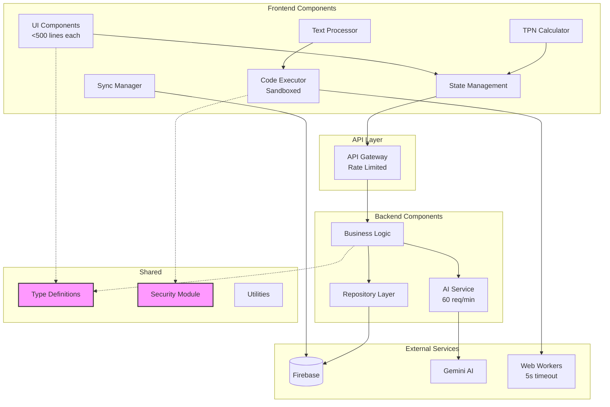

# Components

Based on the architectural patterns, tech stack, and data models, here are the major logical components across the fullstack:

## Frontend Components

### UI Component Library
**Responsibility:** Reusable UI components following Atomic Design principles integrated with Material UI

**Key Interfaces:**
- Atom components (Button, Input, Label, Icon)
- Molecule components (FormField, Card, Alert, SearchInput)
- Organism components (Header, Sidebar, DataTable, Navigation)
- Template layouts (DashboardLayout, EditorLayout, AuthLayout)

**Dependencies:** Material UI, Tailwind CSS, React

**Technology Stack:** TypeScript, React 18, Material UI 7.3.2, Tailwind CSS 4

**Size Constraint:** Each component must be <500 lines (following parent project pattern)

### State Management Layer
**Responsibility:** Global state management for application data and UI state

**Key Interfaces:**
- Redux stores (auth, simulations, templates, config, sections)
- Thunks for async operations
- Selectors for derived state
- RTK Query for API caching

**Dependencies:** Redux Toolkit, Firebase Auth

**Technology Stack:** Redux Toolkit 2.8.2, RTK Query

### TPN Calculator Engine
**Responsibility:** Client-side TPN calculations and validation

**Key Interfaces:**
- `calculateTPN(parameters, ingredients, config): TPNCalculations`
- `validateIngredients(selections, config): ValidationResult`
- `checkReferenceRanges(calculations, config): Warning[]`
- `getTPNValue(key: string): number`
- `hasTPNValue(key: string): boolean`

**Dependencies:** ConfigSchema model, shared types

**Technology Stack:** TypeScript, Web Workers for heavy calculations

### Dynamic Text Processor  
**Responsibility:** Process templates and generate dynamic text with sandboxed JavaScript execution

**Key Interfaces:**
- `processTemplate(template, variables): string`
- `evaluateLogic(rules, context): LogicResult`
- `validateVariables(template, inputs): ValidationResult`
- `executeInSandbox(code, context): Promise<Result>`

**Dependencies:** Template models, logic evaluator, Babel standalone

**Technology Stack:** TypeScript, Web Workers, Babel for transpilation

### Secure Code Executor
**Responsibility:** Safely execute user-provided JavaScript code in isolation (critical from parent project)

**Key Interfaces:**
```typescript
class SecureExecutor {
  async execute(code: string, context: TPNContext): Promise<Result>
  transpile(code: string): string  // Babel transpilation
  sanitizeContext(context: any): SafeContext
  validateCode(code: string): ValidationResult
}
```

**Dependencies:** Web Workers, Babel, DOMPurify

**Technology Stack:** Web Workers with 5s timeout, Babel standalone, DOMPurify for sanitization

### Real-time Sync Manager
**Responsibility:** Manage Firebase real-time subscriptions and offline sync

**Key Interfaces:**
- `subscribeToSimulation(id, callback)`
- `syncOfflineChanges()`
- `handleConflicts(local, remote): Resolution`
- `subscribeToSharedIngredients(callback)`

**Dependencies:** Firebase Firestore, Redux store

**Technology Stack:** Firebase SDK, IndexedDB for offline storage

## Backend Components

### API Gateway
**Responsibility:** Route requests, validate auth, enforce rate limits

**Key Interfaces:**
- Authentication middleware
- Rate limiting middleware (60 req/min for AI endpoints)
- Request validation
- Error handling
- CORS configuration

**Dependencies:** Firebase Admin SDK, Next.js API routes

**Technology Stack:** Next.js 15 API Routes, Firebase Admin

### Business Logic Service
**Responsibility:** Core business operations and orchestration

**Key Interfaces:**
- `SimulationService`: CRUD operations for simulations
- `TemplateService`: Template management
- `ConfigService`: Configuration management
- `CalculationService`: Server-side TPN calculations
- `SectionService`: Section management with versioning
- `IngredientService`: Ingredient sharing and deduplication

**Dependencies:** Repository layer, Firebase services

**Technology Stack:** TypeScript, Next.js API routes

### Repository Layer
**Responsibility:** Abstract data access and provide consistent interface

**Key Interfaces:**
- `ISimulationRepository`
- `ITemplateRepository`
- `IConfigRepository`
- `IUserRepository`
- `ISectionRepository`
- `IIngredientRepository`

**Dependencies:** Firebase Firestore, Firebase Storage

**Technology Stack:** Firebase Admin SDK, TypeScript interfaces

### AI Integration Service
**Responsibility:** Interface with Gemini AI for test generation and recommendations

**Key Interfaces:**
- `generateTests(code, sectionName, context): TestCase[]`
- `generateRecommendations(simulation): Recommendations`
- `enhanceTemplate(template, context): EnhancedTemplate`
- `analyzeCalculations(tpn): Analysis`

**Dependencies:** Gemini API, Business Logic Service

**Technology Stack:** Google AI SDK, TypeScript, rate limiting

## Shared Components

### Type Definitions Package
**Responsibility:** Shared TypeScript interfaces and types

**Key Interfaces:**
- All data model interfaces
- API request/response types
- Validation schemas
- Constants and enums
- TPN context types

**Dependencies:** None (pure TypeScript)

**Technology Stack:** TypeScript 5.7+

### Security Module
**Responsibility:** Input sanitization and security utilities (critical from parent)

**Key Interfaces:**
```typescript
function sanitizeHTML(html: string): string  // DOMPurify
function sanitizeCode(code: string): string
function validateInput(input: any, schema: Schema): boolean
function escapeUserContent(content: string): string
```

**Dependencies:** DOMPurify, validation libraries

**Technology Stack:** DOMPurify with strict config, zod for validation

## Component Interaction Diagram


