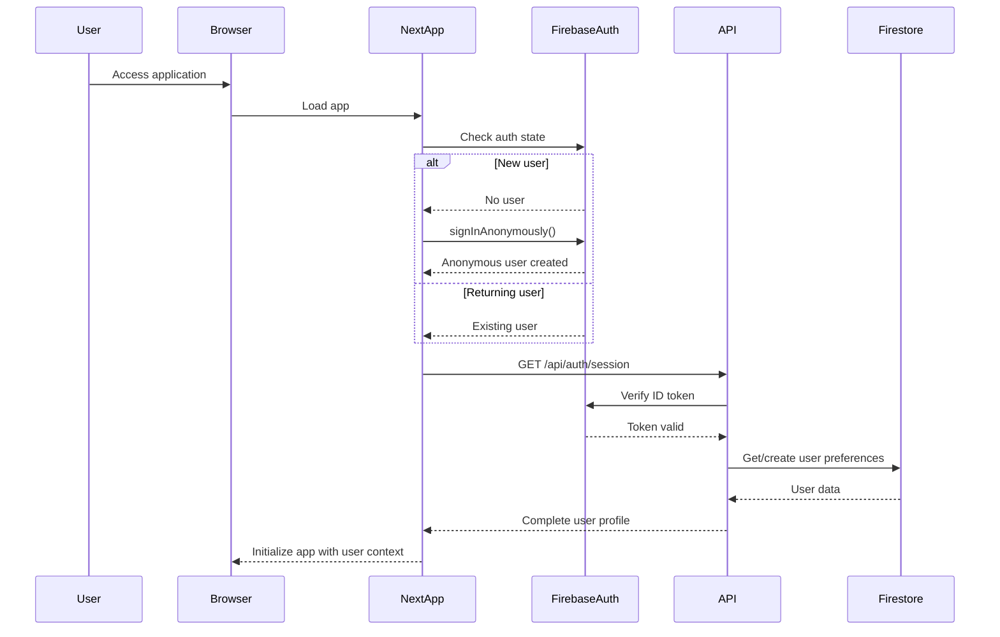
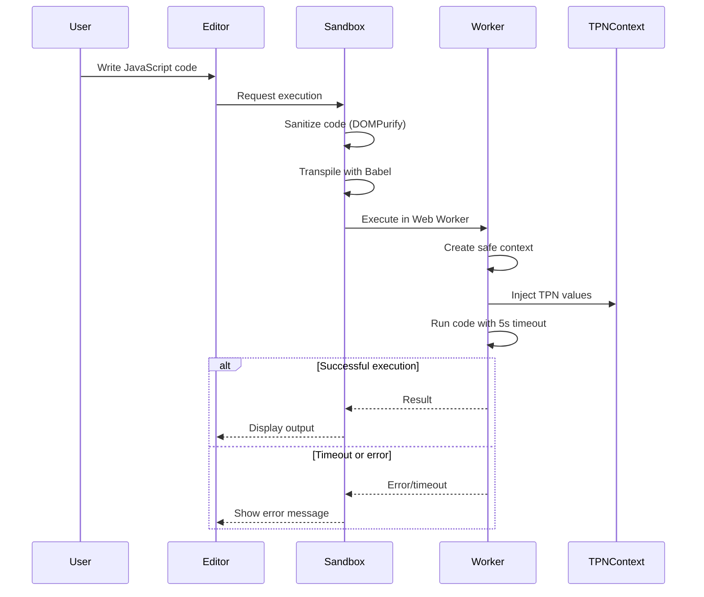
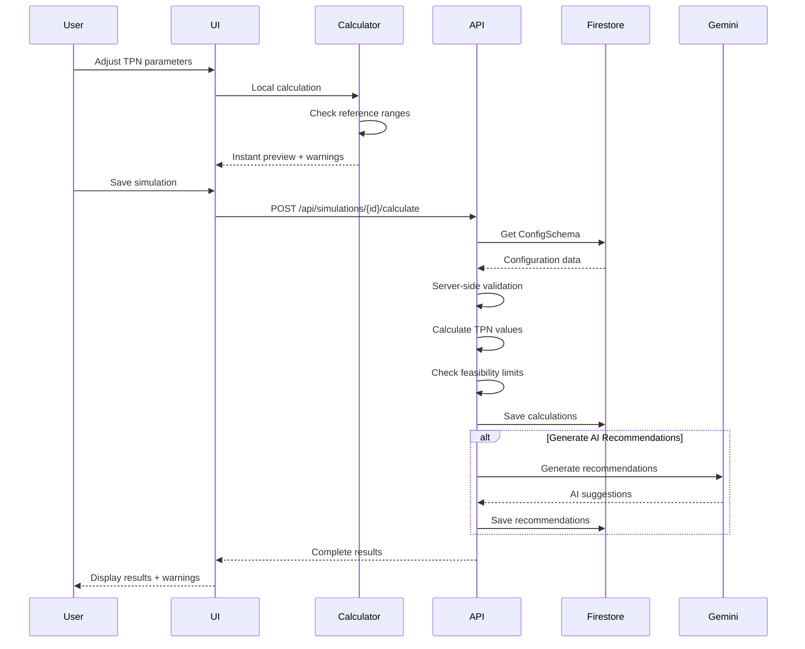
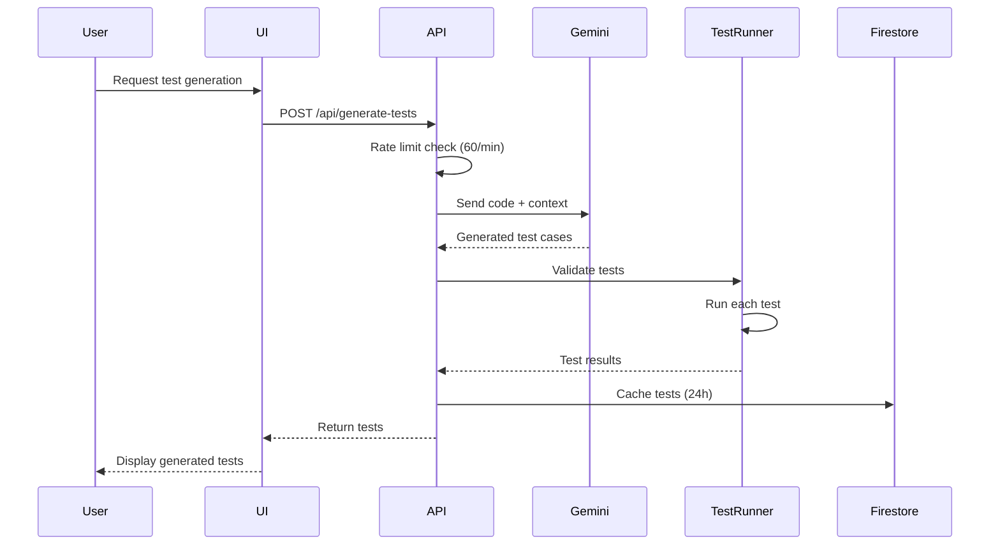
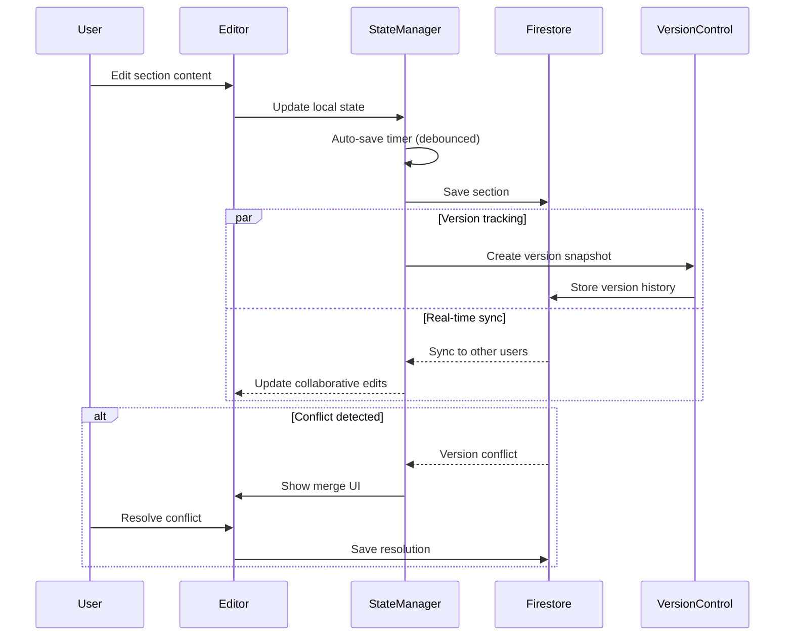
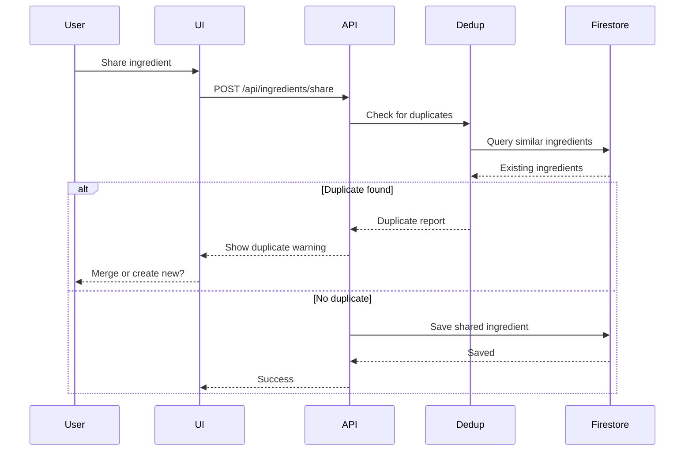

# Core Workflows

Illustrating key system workflows using sequence diagrams:

## User Authentication Flow

## Dynamic Code Execution Flow (Critical from Parent)

## TPN Simulation Calculation Flow

## Test Generation Flow

## Section Content Management Flow

## Ingredient Sharing Workflow

