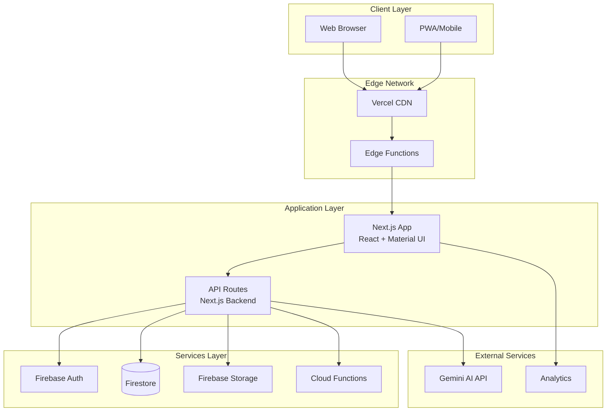

# High Level Architecture

## Technical Summary
The Dynamic Text Next application employs a **serverless JAMstack architecture** with Next.js 15 serving as the fullstack framework, deployed on Vercel with edge functions for optimal performance. The frontend leverages React with Material UI components organized in an FSD + Atomic Design pattern, while the backend will utilize Next.js API routes and Firebase services for authentication, real-time data, and storage. The architecture prioritizes **rapid iteration, type safety, and scalability** through a monorepo structure with shared TypeScript definitions, enabling seamless frontend-backend integration while maintaining clear separation of concerns. This approach delivers on the PRD goals of creating a specialized TPN advisor application with dynamic text generation capabilities, real-time collaboration features, and healthcare-grade data management.

## Platform and Infrastructure Choice

**Platform:** Vercel + Firebase  
**Key Services:** Vercel (hosting, edge functions), Firebase (Auth, Firestore, Storage, Functions)  
**Deployment Host and Regions:** Vercel Global Edge Network with primary region in US-East, Firebase multi-region (us-central1, us-east1)

## Repository Structure
**Structure:** Monorepo  
**Monorepo Tool:** pnpm workspaces (already in use)  
**Package Organization:** Apps-based structure with shared packages for common code between frontend and API routes

## High Level Architecture Diagram

## Architectural Patterns

- **JAMstack Architecture:** Static generation with dynamic API routes for optimal performance - *Rationale:* Maximizes performance while maintaining dynamic capabilities for TPN calculations
- **Feature-Sliced Design (FSD):** Vertical slice architecture organizing by features/domains - *Rationale:* Enforces clear boundaries and dependencies in a growing healthcare application  
- **Atomic Design Components:** Hierarchical component structure from atoms to organisms - *Rationale:* Ensures UI consistency and reusability across complex medical interfaces
- **Repository Pattern:** Abstract Firestore access behind repository interfaces - *Rationale:* Enables testing and potential future migration from Firebase
- **Backend for Frontend (BFF):** Next.js API routes act as BFF layer - *Rationale:* Optimizes data fetching and protects sensitive medical calculations
- **Event-Driven Updates:** Firebase real-time listeners for collaborative features - *Rationale:* Enables real-time collaboration on TPN protocols
- **Edge Computing:** Utilize Vercel Edge Functions for low-latency operations - *Rationale:* Improves performance for global healthcare providers
- **Optimistic UI Updates:** Update UI before server confirmation with rollback - *Rationale:* Provides responsive experience for data entry
- **Command Query Separation:** Separate read/write operations in API design - *Rationale:* Clarifies intent and enables different optimization strategies
